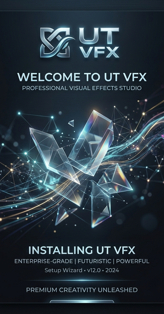

<div align="center">
  

  # 🎬 UTCAP VFX Studio & Central Server
  
  **The ultimate production hub, shot reviewer, and team management suite for professional VFX pipelines.**
  
  []()
  []()
  []()
  [](LICENSE)

</div>

---

## 🚀 Overview

**UTCAP VFX Studio** is a completely reimagined production management software designed from the ground up for modern Visual Effects teams. Moving past traditional setups, it introduces a robust **PostgreSQL-backed Central Server** with a rich Desktop GUI tailored for Supervisors, Artists, and Production Managers.

From checking render line-ups and annotating shot reviews to tracking live workstations and attendance—everything is seamlessly integrated into one unified environment.

---

## ✨ Core Features

*   🎯 **Advanced Shot Review:** High-speed scanning and render checking with full annotation support, approval workflows, and lineup handoffs.
*   📊 **Live Admin Panel & Fleet Management:** Instantly read live JSON workstation statuses from `LiveStatus` across your entire network, and export fleet telemetry with a single click.
*   👥 **Team & Attendance Overview:** Beautiful, double-click administrative dashboards to manage team attendance and track user roles dynamically.
*   🔗 **Seamless DCC Integrations:** Built-in hooks and menus for **Nuke**, **Blender**, **Natron**, and **Silhouette**.
*   🏎️ **High-Performance DB Polling:** Integrated Database Speed Indicators (both compact and full modes) to constantly monitor your PostgreSQL latency.
*   📂 **Kanban & Asset Tracking:** Built-in agile Kanban boards, fast embed caching, and strict naming validation for bulletproof pipelines.

---

## 📦 Installation & Setup

Since the `UTCAP_VFX_Studio` software handles heavy production loads, the required third-party binaries (like **FFmpeg**, **Olive Editor**, **OpenRV**, and **PostgreSQL**) are **not** bundled in this GitHub repository to maintain a lightweight footprint. 

### Local Deployment
1. Clone this repository:
   ```bash
   git clone https://github.com/capsuleutkarsh-design/UTCAP_VFX_Studio.git
   ```
2. For complete setup, refer to the [BUILD_INSTRUCTIONS.md](docs/BUILD_INSTRUCTIONS.md) and [DEPLOYMENT_GUIDE.md](docs/DEPLOYMENT_GUIDE.md).

*(Note: If you downloaded the pre-compiled `.exe` installer from our official releases, the PostgreSQL server and FFmpeg engines will be automatically configured for you).*

---

## 📚 Documentation Index

Our complete architecture and logic guides are built-in. Start here:

*   📖 [**User Manual**](docs/USER_MANUAL.md) - Operator workflows and day-to-day usage.
*   🏗️ [**System Architecture**](docs/SYSTEM_ARCHITECTURE.md) - Deep dive into our client-server interactions.
*   🔧 [**Troubleshooting Guide**](docs/TROUBLESHOOTING_GUIDE.md) - Common problems and fixes.
*   🗄️ [**Database Schema**](docs/DATABASE_SCHEMA.md) - Vector indexes and SQL table relationships.
*   🔄 [**Changelog**](docs/CHANGELOG.md) - Release history.

---

## 🛠 Integrations
<div align="center">
  
  
  
  
</div>

---

## 🤝 Support and Help

For technical support, feature requests, or enterprise pipeline integration, please contact the lead architect:
**Utkarsh Tripathi** - [utkarshtripathi771@gmail.com](mailto:utkarshtripathi771@gmail.com)

<div align="center">
  <i>Designed and authored by <a href="https://github.com/capsuleutkarsh-design">CapsuleUtkarsh-Design</a>. All rights reserved.</i>
</div>
